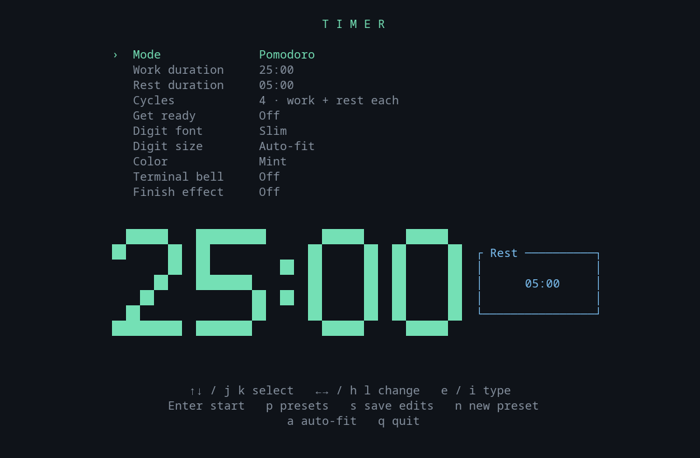
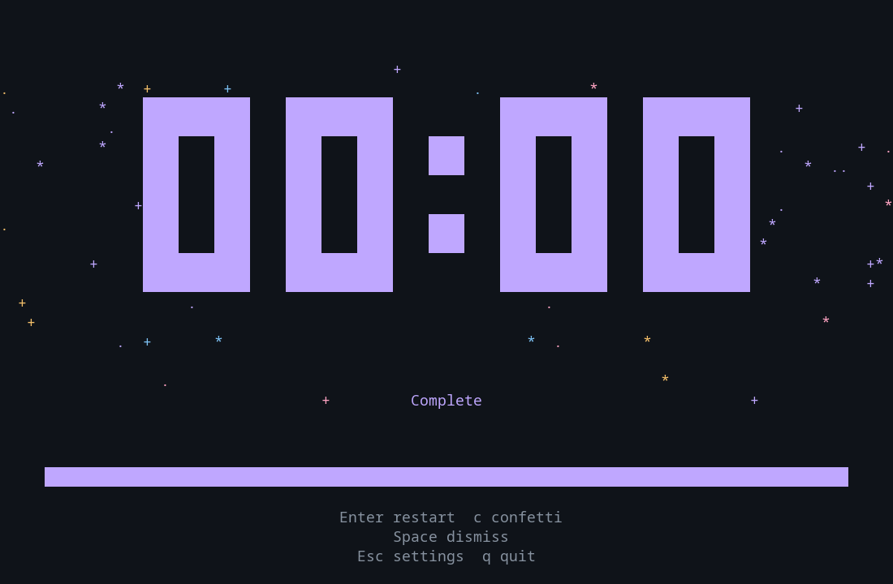

# tui-timer

A small, keyboard-driven timer, stopwatch, and Pomodoro app. Large responsive
digits, visible controls, a live font preview, and editable named presets.
Written in Rust with Ratatui; one native executable with no runtime downloads.



## Run

```sh
cargo run --release
cargo run --release -- --hang
```

After building, run `./target/release/tui-timer` directly for fast startup.
Install with `cargo install --path . --locked` (installs in `~/.cargo/bin`).
Use your terminal's fullscreen shortcut; the digits resize automatically.

```sh
tui-timer                            # remembered setup screen
tui-timer --hang                      # saved hang preset
tui-timer --timer 2m --countdown 5s
tui-timer --stopwatch --no-countdown
tui-timer --pomodoro --work 25m --rest 5m --cycles 4
tui-timer --hang --timer 3m --font slim --theme amber
tui-timer --preset hang --size 2
tui-timer --timer 2m --confetti --theme lavender
tui-timer --list
tui-timer --help
```

Any run options launch immediately. Omitted options inherit remembered settings
or the selected preset. Explicit options override preset settings. Durations accept
seconds (`120`), units (`1m30s`, `2h`), or clock notation (`2:00`).

## Pomodoro

Choose **Pomodoro** under Mode, then set work duration, rest duration, and cycles.
Defaults are 25 minutes of work, 5 minutes of rest, and 4 cycles. Each cycle includes
both work and rest, including the final rest. The app transitions automatically,
then holds at zero after the final rest. An enabled bell sounds at transitions.

The large countdown shows the current period. Beneath it: Work/Rest, current cycle
out of total cycles, and total session time remaining. Rest uses an ice-blue accent.
The optional get-ready countdown runs once before the first work period and is
included in the total time remaining while preparing. Pause freezes all timing.
Restart starts the entire sequence again, including preparation.

## Setup and preview

- **j/k** or **Up/Down**, **Tab/Shift+Tab**: select a setting.
- **h/l** or **Left/Right**: change it. **g/G**: first/last setting.
- **e/i**: type the selected duration or cycle count. Typing replaces the selected
  value; Backspace clears it, Enter saves, Esc cancels.
- **Enter**: start. **q**: quit.
- **p**: open the preset manager. **s**: save edits to the loaded preset.
- **n**: save current settings as a new preset.

Arrow adjustments snap timers to the next/previous 15-second mark and Pomodoro
work/rest periods to the next/previous minute. From the 1-second minimum, Right
therefore moves to 15 seconds or 1 minute. Typed durations remain exact.

The bottom of setup previews the current time, digit style, size, and accent.
Pomodoro also shows a compact rest countdown beside the work preview.
Digit fonts are **Block**, **Slim**, and **Dots**. These are built-in large-digit
styles; the terminal controls the font used for ordinary interface text.

## Stopwatch precision

Stopwatches show hundredths by default: `00:00.00` (two decimal places). Toggle
**Hundredths** in setup, or use `--no-hundredths` / `--hundredths`. This preference
is remembered and saved with presets. Pausing freezes the fractional time too.
After an hour, the display becomes `01:00:00.00`.

## Presets

Press **p** to open the manager:

- **j/k** or **Up/Down** selects a preset; **g/G** jumps to the first/last.
- **Enter/e** edits its settings. Change any field and press **s** to save directly.
- **r** renames it. Type the new name and press Enter; existing names are protected.
- **d** deletes it after **y** confirmation; **n/Esc** cancels deletion.
- **n** creates a preset from the current setup. **Esc** closes the manager.

Every preset is available as `--NAME` or `--preset NAME`. After launching a preset,
Esc returns to its settings; s saves edits without a naming prompt. A title marker
shows unsaved changes. Starting or quitting remembers the setup but only **s**
updates an existing named preset. Loading another preset replaces unsaved edits.

## Running and zoom

**Space** pauses/resumes. Paused digits dim, with a prominent **||** badge and
“Space to resume” hint. **r** restarts, **Esc** opens setup and resets the current session, and **q** quits.
**Ctrl+C** exits anywhere and restores the terminal.

**-/+** or **h/l** shrinks/grows the digits. From auto-fit, zoom starts at the
currently visible size. Shrinking stops at 1; growing stops at what fits. Neither
wraps around. **a** explicitly restores auto-fit. The same behavior applies to
size changes in setup, where the preview determines the available space.

## Completion confetti and themes



Set **Finish effect → Confetti** in setup, or launch with `--confetti`.
The optional five-second burst runs after the timer or final Pomodoro rest finishes;
it never interrupts intermediate work/rest transitions. It is off by default.
At completion, **c** replays it and **Space** dismisses it. `--no-confetti` disables
automatic celebration. Both choices are remembered with settings and presets.
Digits and controls remain in front of the effect; there is no flashing.

Themes: **Mint, Amber, Ice, Mono, Lavender, Rose, Coral, Ocean, Lime, Sand**.
Use the Color setting or `--theme lavender` (lowercase theme names).

## Configuration

Linux: `~/.config/tui-timer/config.toml` (honors `XDG_CONFIG_HOME`). Other platforms
use their OS user config directory. `--config` prints the exact path. The file is
created when starting, saving, or quitting. For isolated development:

```sh
TUI_TIMER_CONFIG=/tmp/my-timer.toml ./target/release/tui-timer
```

The TOML file has `[settings]` and `[presets.NAME]` sections. Existing configurations
continue to load; omitted new fields get defaults. Fields:

- `stopwatch`, `pomodoro`: booleans; both false means timer, only one can be true.
- `seconds`: timer duration; `work_seconds`, `rest_seconds`: Pomodoro durations.
- `cycles`: 1–99 work/rest pairs.
- `hundredths`: show stopwatch fractional seconds (defaults to true).
- `prep`: 0–3600 seconds of get-ready countdown, separate from the timer. Zero is off.
  The one-hour limit applies only to this optional countdown, not to work or rest.
- `font`: 0 Block, 1 Slim, 2 Dots. `size`: 0 auto-fit or 1–8.
- `theme`: 0 Mint, 1 Amber, 2 Ice, 3 Mono, 4 Lavender, 5 Rose, 6 Coral,
  7 Ocean, 8 Lime, 9 Sand. Existing indexes stay compatible.
- `confetti`: optional completion animation (defaults to false).
- `bell`: terminal bell at transitions/finish; sound depends on terminal preferences.

Durations are 1–359999 seconds. Preset names start with a lowercase letter and use
lowercase letters, digits, or hyphens, up to 32 characters. CLI option names are
reserved. Invalid configuration is reported instead of silently replaced.

## Development

```sh
cargo test
cargo clippy --all-targets -- -D warnings
cargo build --release --locked
uv run --with pyte --with pillow scripts/test_terminal.py
```

The Linux PTY integration test exercises preset create/edit/rename/delete, Vim
navigation, countdown, pause/resume, Pomodoro cycles, stopwatch, fonts, resize, and
terminal-mode restoration. It saves screenshots in `target/qa/` and measures
launch-to-first-frame. Unit tests cover monotonic timing, delayed frames, total
session time, zoom boundaries, configuration compatibility, and parsing.

## Review notes

[Performance review](docs/performance-review.md) records measured startup/CPU and
optimization decisions. [UX research and backlog](docs/ux-review.md) records the
agent's sourced findings, implemented fixes, and larger ideas deferred for discussion.
Static screens now wait for keyboard/resize events instead of redrawing continuously;
running clocks and confetti retain a bounded animation cadence.
